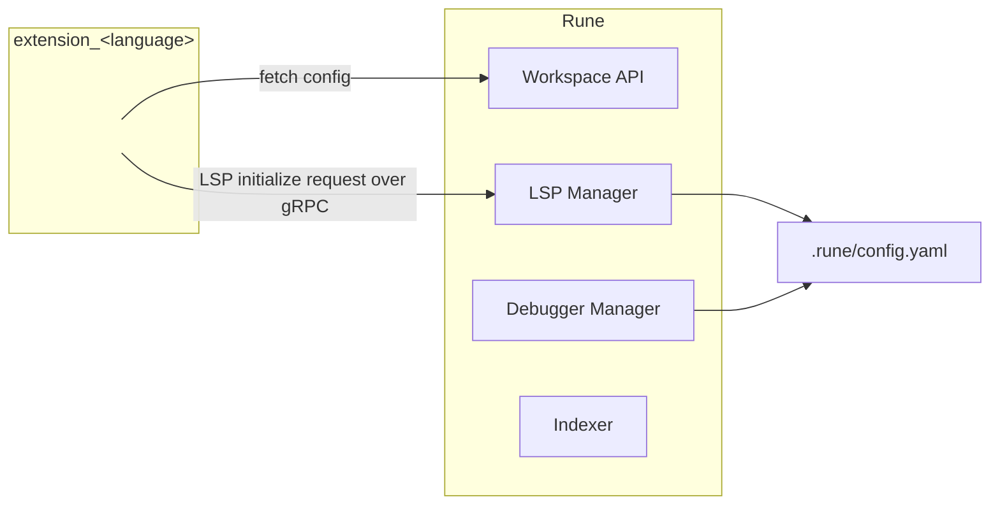

# Languages

This guide describes the fastest way to bring a new programming language to
Rune. You will start with Rune's Python integration, change it into an
[extension](./extensions.md) for your language, add syntax and indexing support,
and turn the result into an installable [package](./packages.md).

The Python extension is a good starting point because it has all the important
parts without requiring you to understand every Rune subsystem first. It finds
projects, performs the project-specific setup needed by its language server,
requests LSP initialization, and registers Python-specific commands. It is a Go
program, but it supports Python. The
[Rust](https://github.com/unstablebuild/rune/tree/main/cmd/extension_rust) and
[Zig](https://github.com/unstablebuild/rune/tree/main/cmd/extension_zig)
extensions work the same way: the language an extension is written in does not
have to be the language it supports.

Your first useful milestone is deliberately small:

1. Open a representative project in Rune.
2. Have `extension_<language>` recognize its project root.
3. Have the extension ask Rune to start one language server for that root.
4. See diagnostics or go-to-definition work in a source file.

Get that path working before packaging a debugger or toolchain, or advertising
every language-server capability.

## How the pieces fit together



Rune and the language extension have separate jobs. Rune owns the editor, the
indexer, language-server processes, and debugger sessions. The extension runs as
a separate subprocess and communicates with Rune through the
[workspace APIs](https://github.com/unstablebuild/rune-go-sdk/blob/main/api/extensionapi/workspace.go)
over gRPC. For language integration, it discovers project roots and asks Rune's
LSP Manager to initialize the appropriate language server for each root. It does
not configure the Debugger Manager or supply data to the Indexer.

The installed language package also contributes configuration defaults, including
the `debugger.<langid>` configuration used by Rune's Debugger Manager. Rune merges
those defaults with the user's `.rune/config.yaml`; the extension receives the
resulting configuration through its workspace session.

Adding a language requires syntax support inside Rune as well as an extension.
There are two layers to that syntax support:

- The language package supplies a native Tree-sitter grammar and `.scm` queries
  for highlighting, indentation, folding, local definitions, references, and
  scopes. Rune loads and executes those files; the extension does not.
- Rune core contains a language-specific indexer specification for behavior
  that a local syntax query cannot explain by itself: packages or modules,
  imports, aliases, methods, visibility, and re-exports. Read the existing
  [Go](https://github.com/unstablebuild/rune/blob/main/internal/ide/idelsp/symbolresolve/golang.go),
  [Rust](https://github.com/unstablebuild/rune/blob/main/internal/ide/idelsp/symbolresolve/rust.go),
  and
  [Zig](https://github.com/unstablebuild/rune/blob/main/internal/ide/idelsp/symbolresolve/zig.go)
  specifications before writing yours.

The extension is responsible for the parts that depend on a real workspace and
its tools:

- **Initialize the language server.** The extension builds the standard
  [`initialize`](https://microsoft.github.io/language-server-protocol/specifications/lsp/3.17/specification/#initialize)
  request for each project root, including the server command, initialization
  options, and the capabilities Rune should advertise. It sends that request to
  Rune's LSP Manager over gRPC. See the exact calls for
  [Go](https://github.com/unstablebuild/rune/blob/main/cmd/extension_go/extension.go#L170-L177),
  [Python](https://github.com/unstablebuild/rune/blob/main/cmd/extension_python/extension.go#L170-L187),
  [Rust](https://github.com/unstablebuild/rune/blob/main/cmd/extension_rust/extension.go#L210-L217),
  and
  [Zig](https://github.com/unstablebuild/rune/blob/main/cmd/extension_zig/extension.go#L169-L181).
- **Find and prepare projects.** A workspace may contain several independent
  projects. The extension decides which files mark a project root, associates
  opened source files with the nearest root, and prepares that project's
  environment before starting its server. Python, for example, recognizes
  `pyproject.toml`, requirements files, and `.venv` directories in
  [`env.go`](https://github.com/unstablebuild/rune/blob/main/cmd/extension_python/env.go#L45-L88).
- **Resolve the language server used for each project.** The extension selects
  the packaged server or a configured override and includes its command in the
  initialization request. Any project-specific environment work needed before
  that request also belongs here. This is separate from packaging the server,
  compiler, formatter, or debug adapter for distribution.
- **Add the language's own workflows.** LSP provides a common baseline, but the
  best integrations also expose useful ecosystem operations as Rune commands.
  Rust's extension, for example, exposes rust-analyzer operations and `rustup`
  workflows rather than hiding them behind a generic feature set.

All of this eventually needs to be packaged. The packaging layer supplies the
extension executable, grammar, syntax queries, and language tools. Its
`config.yaml` registers the extension and configures Rune-owned services such as
`debugger.<langid>`; see the
[Go debugger configuration](https://github.com/unstablebuild/rune-language-go/blob/main/config.yaml#L24-L32)
and
[Python debugger configuration](https://github.com/unstablebuild/rune-language-python/blob/main/config.yaml#L40-L62).
Keep the
[Python language package](https://github.com/unstablebuild/rune-language-python)
open while following this guide; it is the complete example used below.

## 1. Fork Rune and copy the Python extension

Start by following the [Rune build guide](./building.md). Build Rune and run its
tests before changing anything, so failures introduced by the new integration
are easy to recognize.

Create a branch in your Rune fork, then copy the Python extension:

```bash
git checkout -b language-<language>
cp -R cmd/extension_python cmd/extension_<language>
```

For example, an Elixir integration would begin in `cmd/extension_elixir`.

Do not try to preserve every Python feature while renaming the directory. Strip
the copy down until it builds, then add your language one responsibility at a
time. The files worth understanding first are:

- [`main.go`](https://github.com/unstablebuild/rune/blob/main/cmd/extension_python/main.go),
  which starts the extension process.
- [`extension.go`](https://github.com/unstablebuild/rune/blob/main/cmd/extension_python/extension.go),
  which declares permissions, connects workspace services, discovers projects,
  and initializes each project root.
- [`initialize.go`](https://github.com/unstablebuild/rune/blob/main/cmd/extension_python/initialize.go),
  which builds the LSP initialization request.
- [`env.go`](https://github.com/unstablebuild/rune/blob/main/cmd/extension_python/env.go),
  which recognizes Python projects and prepares their environment.
- [`lookup.go`](https://github.com/unstablebuild/rune/blob/main/cmd/extension_python/lookup.go),
  which finds tools on the workspace host.
- [`handler.go`](https://github.com/unstablebuild/rune/blob/main/cmd/extension_python/handler.go),
  which implements Python-specific console commands.

For the first compile, remove Python's command handler, `uv` environment setup,
debugpy prewarming, and `pyshim` package. Rename the remaining `py...` types and
functions, replace `.py` with your source extension, and temporarily make your
per-project initialization function do nothing. Keep the extension entry point,
metadata, workspace clients, and `langext.Initializer` wiring. This leaves a
small program that Rune can start and that you can extend in the order used by
this guide.

Run the package tests after every step:

```bash
go test ./cmd/extension_<language>
```

Change the metadata in `NewExtension` first. Give the extension a stable ID and
human-readable name, and remove permissions you do not need. Python's current
metadata is
[here](https://github.com/unstablebuild/rune/blob/main/cmd/extension_python/extension.go#L36-L57).
The ID should be short, lowercase, and consistent everywhere. If the ID is
`elixir`, use it for the extension ID, LSP language ID, package name, and syntax
language ID; name the executable `extension_elixir`.

Keep the copied entry point. `ServeWorkspaceExtension` performs the initial
handshake with Rune and keeps the extension process alive for the workspace
session:

```go
func main() {
    ext, metadata := NewExtension()
    if err := extensionapi.ServeWorkspaceExtension(ext, metadata); err != nil {
        slog.Error("serve extension", "error", err)
        os.Exit(1)
    }
}
```

An extension's standard output is used by the startup protocol, so do not print
banners or debug messages there. Use structured logging instead. For more about
the process model, permissions, and configuration, read
[Extensions](./extensions.md).

## 2. Teach the extension to recognize a project

A language server needs a root directory. In a simple repository that may be the
workspace root, but real workspaces often contain several projects:

```text
workspace/
├── service-a/
│   └── <project marker>
├── service-b/
│   └── <project marker>
└── scripts/
    └── one-off.<ext>
```

Choose the files that unambiguously identify a project in your ecosystem. Rust
uses `Cargo.toml`; Zig uses `build.zig` and `build.zig.zon`; Python checks
`pyproject.toml`, several requirements filenames, and `.venv`. Decide whether a
loose source file with no manifest should start a server at the workspace root.

The built-in language extensions use Rune's
[`langext.Initializer`](https://github.com/unstablebuild/rune/blob/main/internal/extension/langext/initializer.go)
to combine two behaviors:

1. If the workspace root is already a project, initialize it immediately.
2. When a source file is opened later, walk toward the workspace root, find its
   nearest project marker, and initialize that root once.

Python wires those pieces together in a small block:

```go
init := langext.NewInitializer(ctx, fs, editor, langext.ProjectConfig{
    LanguageID: "python",
    Markers:    pyMarkers,
    FileMatch:  isPythonFile,
    InitRoot: func(ctx context.Context, root langext.Root) error {
        return initializeProjectRoot(ctx, fs, exec, notify, lsp, inst, cfg, dataDir, root)
    },
})
if err := init.Start(); err != nil {
    return fmt.Errorf("subscribe python open events: %w", err)
}
```

See the complete code, including eager initialization of a root project, in
[`extension.go`](https://github.com/unstablebuild/rune/blob/main/cmd/extension_python/extension.go#L107-L128).
Replace `python`, `pyMarkers`, and `isPythonFile` with your language's values,
then make `InitRoot` call your own bring-up function.

`langext` is an internal helper for integrations built in the Rune repository.
An extension maintained in another Go module cannot import it as public SDK. It
can implement the same behavior with the
[editor](https://github.com/unstablebuild/rune-go-sdk/tree/main/api/textapi) and
[filesystem](https://github.com/unstablebuild/rune-go-sdk/tree/main/api/workspaceapi)
clients from the public SDK.

Always use the workspace filesystem and executor passed by Rune. Do not replace
them with `os.Stat` or `os/exec`: the workspace may be on another machine over
SSH, while the extension process and Rune UI are local. The workspace clients
make the same extension work in both cases.

Before moving on, test these cases:

- The workspace root contains a project marker.
- A project lives in a nested directory.
- Two sibling projects are open at the same time.
- A source file has no enclosing project marker.
- Opening several files in one project does not start several servers.

## 3. Prepare the project for its language server

Once you have a project root, prepare whatever the language server expects to
find there. Keep this logic in one function that receives the root and ends by
initializing its language server. Python's
[`initializeProjectRoot`](https://github.com/unstablebuild/rune/blob/main/cmd/extension_python/extension.go#L132-L190)
is a useful model: it prepares the project's `uv` environment, resolves `ty` and
Ruff, and then sends the LSP initialization request. The `debugpy` prewarming in
the same function is specific to Python's runtime packaging choice, not a
general responsibility of a language extension.

Use the lightest setup that makes a fresh project useful. For example:

- An interpreted language may need an interpreter and dependency environment.
- A compiled language may need a compiler or sysroot that the server can inspect.
- A server may need the absolute path to the formatter or compiler in its
  initialization options.

Not every setup failure needs to disable language support. Python warns when
environment synchronization fails and still starts its language server, because
partial analysis is better than no analysis. Make the same decision explicitly
for your ecosystem: fail only when the server cannot do useful work.

When the package includes the language server, its executable should be resolved through
[`FindInstalledExecutable`](https://github.com/unstablebuild/rune-go-sdk/blob/main/api/extensionapi/workspace.go),
as Python does in
[`lookup.go`](https://github.com/unstablebuild/rune/blob/main/cmd/extension_python/lookup.go#L28-L58).
Support a user-configured path when appropriate, then decide whether a missing
packaged binary should fall back to the workspace host's `PATH`. Treat “not
installed” differently from permission, filesystem, and network errors; those
usually deserve a visible warning rather than a silent fallback.

## 4. Initialize the language server

The extension does not launch the language server and speak LSP itself. It asks
Rune's LSP Manager to do that through the SDK's `semanticapi.LSP` client. Rune
owns the server process, routes editor requests to it, restarts or stops it with
the workspace, and keeps LSP concerns out of the extension process.

At the end of your per-project bring-up, build an
[`InitializeParams`](https://github.com/unstablebuild/rune-go-sdk/blob/main/api/semanticapi/lsp.go)
value and call `Initialize`. The Go integration shows the essential control
flow clearly:

```go
params, err := goplsInitializeParams(root.URI, dbg, goplsBin)
if err != nil {
    return fmt.Errorf("build init params: %w", err)
}
if _, err := lsp.Initialize(ctx, params); err != nil {
    return fmt.Errorf("initialize gopls: %w", err)
}
```

That example is taken from
[`initializeGoRoot`](https://github.com/unstablebuild/rune/blob/main/cmd/extension_go/extension.go#L156-L186).
The complete parameter builders for
[Go](https://github.com/unstablebuild/rune/blob/main/cmd/extension_go/initialize.go#L47-L208),
[Python](https://github.com/unstablebuild/rune/blob/main/cmd/extension_python/initialize.go#L48-L217),
[Rust](https://github.com/unstablebuild/rune/blob/main/cmd/extension_rust/initialize.go#L26-L253),
and
[Zig](https://github.com/unstablebuild/rune/blob/main/cmd/extension_zig/initialize.go#L45-L209)
show how four different servers are configured.

An initialization request has three important parts.

### Root URI

Use the URI of the project discovered in the previous step, not automatically
the top-level workspace URI. In a monorepo, each project may need its own server,
environment, and initialization options.

### Initialization options

The map begins with two fields Rune consumes:

```go
initOptions := map[string]any{
    "langID":  "<language>",
    "command": "<language-server> --stdio",
}
```

`langID` selects the language and `command` tells Rune what to start. Rune also
understands `alternate_commands`, which can route selected methods to another
server, and `env`, which supplies the server's environment. Python uses
`alternate_commands` to send formatting to Ruff while `ty` remains the primary
server; see
[`pyInitializeParams`](https://github.com/unstablebuild/rune/blob/main/cmd/extension_python/initialize.go#L48-L70).

Rune removes its routing fields before forwarding the remaining initialization
options to the language server. This lets you place server-specific settings in
the same map. Consult your server's documentation rather than copying Python's
options.

### Client capabilities

Capabilities are promises about what Rune can handle, not a wish list of what
you want the server to provide. Start with the capabilities needed for your
first test—diagnostics, hover, definitions, and completion are common choices—
then add more as you test them.

Different servers interpret the same capability map differently. Zig's server,
for example, needs `workspaceFolders` and an advertised diagnostics capability;
the integration also disables snippet placeholders because Rune inserts its
completion text literally. Rust's initialization code is intentionally careful
about rust-analyzer client commands that Rune can actually service. Read those
comments before copying either map.

At this point, build the extension and test it with the real server against one
small project. Confirm the server starts at the expected root and inspect its
logs before adding more features.

Do not stop at an extension test. Add a Rune-core LSP suite for the language in
`internal/ide/idelsp/<file-id>_test.go`. It must start the real server through
Rune's LSP Manager and exercise the features you claim to support against a
committed project under `internal/ide/idelsp/testdata/`. The existing
[Go](https://github.com/unstablebuild/rune/blob/main/internal/ide/idelsp/go_test.go),
[Python](https://github.com/unstablebuild/rune/blob/main/internal/ide/idelsp/py_test.go),
[Rust](https://github.com/unstablebuild/rune/blob/main/internal/ide/idelsp/rs_test.go),
and
[Zig](https://github.com/unstablebuild/rune/blob/main/internal/ide/idelsp/zig_test.go)
suites are the pattern to follow. These are end-to-end tests behind the `e2e`
build tag, not mocked protocol tests.

## 5. Add the grammar and syntax queries

LSP gives Rune semantic answers from a server. It does not provide the syntax
tree Rune uses while editing. Highlighting, indentation, folding, local symbols,
and much of indexing begin with a Tree-sitter grammar and query files.

Your installed language package must contain:

| File | What Rune uses it for |
| --- | --- |
| `lib/tree-sitter.so` | Native parser for the language. |
| `lib/highlights.scm` | Syntax highlighting captures. |
| `lib/indents.scm` | Structural indentation. |
| `lib/folds.scm` | Foldable regions. |
| `lib/locals.scm` | Definitions, references, scopes, and local symbols. |

Some grammars already publish useful queries. Others need queries from a project
such as nvim-treesitter or custom queries written for Rune. Python's package
currently combines
[the grammar's highlighting query](https://github.com/tree-sitter/tree-sitter-python/blob/master/queries/highlights.scm)
with nvim-treesitter's indentation, folding, and
[`locals.scm`](https://github.com/unstablebuild/rune-language-python/blob/main/nvim-treesitter/queries/python/locals.scm#L1-L125).
The exact files copied into the package are visible in the
[Python Makefile](https://github.com/unstablebuild/rune-language-python/blob/main/Makefile#L99-L113).

The most important file for indexing is `locals.scm`. It labels syntax nodes
with captures such as:

```scheme
@local.definition.function
@local.definition.method
@local.definition.type
@local.definition.var
@local.reference
@local.scope
```

Do not write these captures by guessing node names. Inspect representative files
with your grammar's Tree-sitter tooling, look at the actual parse trees, and
write one query at a time. The existing
[Go](https://github.com/unstablebuild/rune-language-go/blob/main/nvim-treesitter/queries/go/locals.scm#L1-L88),
[Rust](https://github.com/unstablebuild/rune-language-rust/blob/main/nvim-treesitter/queries/rust/locals.scm#L1-L98),
[Python](https://github.com/unstablebuild/rune-language-python/blob/main/nvim-treesitter/queries/python/locals.scm#L1-L125),
and
[Zig](https://github.com/unstablebuild/rune-language-zig/blob/main/tree-sitter-zig/queries/locals.scm#L1-L96)
queries are practical references.

Rune looks up syntax assets by language ID. The native library must also export
the grammar symbol Rune expects, usually `tree_sitter_<languageID>`. Renaming a
shared library does not change that exported symbol. If the grammar's identifier
and your Rune language ID differ, resolve that mismatch deliberately.

Finally, make sure Rune maps your source filenames to the same language ID. The
normal case is inferred from the filename extension. Languages with several
extensions, special filenames, or an ID that differs from the extension need an
entry in
[`languages.go`](https://github.com/unstablebuild/rune/blob/main/internal/ide/idelsp/languages/languages.go).

Add the corresponding Rune-core syntax suite at
`internal/ide/syntax/syntaxtest/<file-id>_test.go`. Commit a package-shaped
fixture directory containing the real native parser and the real
`highlights.scm`, `indents.scm`, `folds.scm`, and `locals.scm` files. The suite
must load those assets through Rune and run them against representative source,
including incomplete code. Follow the existing
[Go](https://github.com/unstablebuild/rune/blob/main/internal/ide/syntax/syntaxtest/go_test.go),
[Python](https://github.com/unstablebuild/rune/blob/main/internal/ide/syntax/syntaxtest/py_test.go),
[Rust](https://github.com/unstablebuild/rune/blob/main/internal/ide/syntax/syntaxtest/rs_test.go),
and
[Zig](https://github.com/unstablebuild/rune/blob/main/internal/ide/syntax/syntaxtest/zig_test.go)
suites. A test that mocks captures or reads different query files from the ones
you package does not satisfy this requirement.

## 6. Teach the indexer how names cross files

`locals.scm` can tell Rune that a node defines a function or references a name.
It cannot, by itself, answer questions such as:

- Does `http.Client` refer to a package, module, type, or field?
- What local name does an import introduce?
- Is a declaration visible from another file?
- Which type owns a method?
- Does an index file re-export a name from another module?

Those rules live in a language-specific
[`symbolresolve.Spec`](https://github.com/unstablebuild/rune/blob/main/internal/ide/idelsp/symbolresolve/spec.go#L82-L165)
inside Rune core. Copy the existing spec closest to your language's module
system, rename it, and replace its queries and callbacks. Then add it to the
[`registry`](https://github.com/unstablebuild/rune/blob/main/internal/ide/idelsp/symbolresolve/registry.go#L26-L39).

Choose examples by semantics, not syntax:

- [Go](https://github.com/unstablebuild/rune/blob/main/internal/ide/idelsp/symbolresolve/golang.go#L26-L59)
  is useful for package clauses, import aliases, exported-name rules, and
  receiver methods.
- [Python](https://github.com/unstablebuild/rune/blob/main/internal/ide/idelsp/symbolresolve/python.go#L27-L56)
  demonstrates dotted modules, file-derived qualifiers, and re-exports from
  `__init__.py`.
- [Rust](https://github.com/unstablebuild/rune/blob/main/internal/ide/idelsp/symbolresolve/rust.go#L26-L52)
  demonstrates path expressions, file-derived module names, and methods inside
  `impl` blocks.
- [Zig](https://github.com/unstablebuild/rune/blob/main/internal/ide/idelsp/symbolresolve/zig.go#L27-L64)
  demonstrates `@import` aliases, field expressions, and methods declared in
  container types.

Add focused fixtures while writing the spec. Test imports with and without
aliases, two symbols with the same name, nested modules, private declarations,
methods, unresolved references, and incomplete code. It is better to leave a
dynamic or ambiguous construct unresolved than to jump to the wrong definition.

Put those cases in
`internal/ide/idelsp/symbolresolve/<file-id>_test.go`, backed by a committed,
multi-file `testdata_<file-id>/` project. The suite must use the real native
parser, the packaged syntax queries, and the real resolver specification. The
[Go](https://github.com/unstablebuild/rune/blob/main/internal/ide/idelsp/symbolresolve/go_test.go),
[Python](https://github.com/unstablebuild/rune/blob/main/internal/ide/idelsp/symbolresolve/py_test.go),
[Rust](https://github.com/unstablebuild/rune/blob/main/internal/ide/idelsp/symbolresolve/rs_test.go),
and
[Zig](https://github.com/unstablebuild/rune/blob/main/internal/ide/idelsp/symbolresolve/zig_test.go)
suites show the required structure. A passing language-server test does not
replace this suite because Rune's indexer resolves these names independently of
the language server.

## 7. Add debugging and language-specific commands

Do this after project discovery, LSP, and syntax work. Debugging introduces a
second protocol and another tool process, while ecosystem commands are easiest
to design after you have used the integration on real projects.

Rune's Debugger Manager owns debug sessions and speaks the Debug Adapter
Protocol. The language package tells it how to start an adapter through
`config.yaml`. Python registers `debugpy` with its command, adapter ID, and
launch/attach defaults in
[`config.yaml`](https://github.com/unstablebuild/rune-language-python/blob/main/config.yaml#L40-L62).

The language package may include an adapter binary or configure a command that
resolves one from the packaged toolchain at runtime. That decision belongs to the
package and its `debugger.<langid>` configuration, not to the extension-to-LSP
relationship shown above. Whichever model you choose, test it with the real
adapter: set a breakpoint, launch a program, inspect stack frames and variables,
and attach to an existing process when the adapter supports it.

If the language supports debugging, add
`internal/ide/ideshell/debugshell/<file-id>_test.go` and a deterministic program
under `internal/ide/ideshell/debugshell/testdata/`. The test must use Rune's real
Debugger Manager, the supported debug adapter, the real compiler or interpreter,
and the language's real syntax assets. Follow the
[Go](https://github.com/unstablebuild/rune/blob/main/internal/ide/ideshell/debugshell/go_test.go),
[Python](https://github.com/unstablebuild/rune/blob/main/internal/ide/ideshell/debugshell/py_test.go),
[Rust](https://github.com/unstablebuild/rune/blob/main/internal/ide/ideshell/debugshell/rs_test.go),
and
[Zig](https://github.com/unstablebuild/rune/blob/main/internal/ide/ideshell/debugshell/zig_test.go)
suites. These tests belong behind the `e2e` build tag because they launch real
tools and speak the Debug Adapter Protocol through Rune's production path.

Then expose operations that make your ecosystem distinctive. The copied Python
[`handler.go`](https://github.com/unstablebuild/rune/blob/main/cmd/extension_python/handler.go)
shows how an extension registers a command and executes tools through the
workspace API. Replace it with workflows developers of your language already
use: test selection, dependency management, code generation, project tasks,
toolchain selection, server-specific actions, or framework commands.

## 8. Package the integration

First-party languages ship from repositories separate from Rune. The existing
repositories are
[Go](https://github.com/unstablebuild/rune-language-go),
[Python](https://github.com/unstablebuild/rune-language-python),
[Rust](https://github.com/unstablebuild/rune-language-rust), and
[Zig](https://github.com/unstablebuild/rune-language-zig).

Fork or copy `rune-language-python` into `rune-language-<language>`. Remove the
Python-specific tools, then use the same layout for your inputs and build. The
repository should pin the exact Rune revision containing your extension and the
exact grammar/query revisions used by the package. Python does that through
[Git submodules](https://github.com/unstablebuild/rune-language-python/blob/main/.gitmodules).

The build assembles this staging directory:

```text
pkg/
├── bin/
│   ├── extension_<language>
│   ├── <language-server>
│   └── <formatter-or-debug-adapter>
├── lib/
│   ├── tree-sitter.so
│   ├── highlights.scm
│   ├── indents.scm
│   ├── folds.scm
│   └── locals.scm
└── config.yaml
```

Not every tool has to be bundled. Python packages `uv`, `uvx`, Ruff, and `ty`,
uses `uv` to install an interpreter on first run, and resolves a compatible
`debugpy` environment through `uvx`. The comments and targets in its
[Makefile](https://github.com/unstablebuild/rune-language-python/blob/main/Makefile)
explain that trade-off. Pick the model that is reliable for your language on a
fresh machine and in a remote workspace.

The package's `config.yaml` connects the files in `pkg/` to Rune. At minimum it
registers the extension executable and editor conventions. It may also add
environment variables, command aliases, and a debugger adapter. A reduced
example looks like this:

```yaml
extensions:
  <language>:
    path: '$RUNE_DATADIR/bin/extension_<language>'
    config:
      lsp_path: ""

debugger:
  <language>:
    command: '<debug-adapter> --port {port}'
    adapter_id: '<adapter-id>'
    launch:
      request: launch
      type: '<adapter-id>'

editor:
  comments:
    <language>:
      line:
        - "//"
```

Do not copy that verbatim. Start from the complete
[Python configuration](https://github.com/unstablebuild/rune-language-python/blob/main/config.yaml)
or a language with a toolchain similar to yours.

Use the package Makefile as the executable release specification. It should:

1. Fetch or build the language tools for the target OS and architecture.
2. Compile the Tree-sitter grammar, including any external scanner it needs.
3. Copy all required `.scm` queries into `pkg/lib`.
4. Build `cmd/extension_<language>` into `pkg/bin`.
5. Copy `config.yaml` to the root of `pkg`.
6. Sign and notarize executable code on macOS.
7. Archive the **contents** of `pkg/` as `<language>.tar.gz`.

Compare the concrete build recipes for
[Python](https://github.com/unstablebuild/rune-language-python/blob/main/Makefile#L74-L142),
[Rust](https://github.com/unstablebuild/rune-language-rust/blob/main/Makefile),
and
[Zig](https://github.com/unstablebuild/rune-language-zig/blob/main/Makefile).
Native grammars, external scanners, language servers, debuggers, and toolchains
may all have different cross-compilation requirements; successfully building the
Go extension does not prove the package works on the target.

Test the artifacts users will download, not only the staging directory. Inspect
the final tarball and, when produced, the macOS notarization zip. Verify that
required binaries and query files are present, executable permissions are
correct, debugger libraries are beside the adapter where it expects them, and
no `.go` files from the Rune submodule leaked into a non-Go language package.
The
[Rust](https://github.com/unstablebuild/rune-language-rust/blob/main/scripts/test.sh)
and
[Zig](https://github.com/unstablebuild/rune-language-zig/blob/main/scripts/test.sh)
release tests show these checks in practice.

Publishing a new first-party package requires coordination with Rune's release
infrastructure. You can build and install the package locally before that. Once
it is published and registered, users should be able to install the complete
integration with:

```text
pkg install <language>
```

## 9. Test the integration as a whole

The Rune-core language suites are a requirement for [Tier 1 support](../languages/supported.md#support-tiers). When
you add functionality at one of these layers, add or extend the corresponding
`<file-id>_test.go` suite in the same change. Do not rely only on unit tests in
`cmd/extension_<language>`.

The filename token normally follows the source suffix used by the existing
suite. Go uses `go_test.go`, Python uses `py_test.go`, Rust uses `rs_test.go`, and
Zig uses `zig_test.go`. This token is not always the runtime language ID. For
example, `py_test.go` still initializes the server with `langID: "python"`, and
`rs_test.go` uses `langID: "rust"`.

Each suite protects a different boundary:

| Required core suite | What it must prove | Fixture |
| --- | --- | --- |
| `internal/ide/idelsp/<file-id>_test.go` | Rune can initialize and use the real supported LSP server, including the capabilities and server-specific options the extension advertises. | A buildable project in `internal/ide/idelsp/testdata/`. |
| `internal/ide/syntax/syntaxtest/<file-id>_test.go` | Rune can load the real native grammar and packaged `.scm` queries and use them for highlighting, indentation, folds, definitions, references, scopes, and incremental edits. | A package-shaped syntax fixture plus representative valid and incomplete source. |
| `internal/ide/idelsp/symbolresolve/<file-id>_test.go` | Rune's own indexer understands the language's modules, imports, aliases, methods, visibility, ambiguity, and re-exports. | A real multi-file project in `symbolresolve/testdata_<file-id>/`. |
| `internal/ide/ideshell/debugshell/<file-id>_test.go` | Rune can launch or attach through the real debug adapter, set breakpoints, stop, inspect stack frames and variables, continue, and terminate. Required when debugging is supported. | A deterministic executable project in `debugshell/testdata/`. |

The extension should also retain its own end-to-end suite, such as
[Python's `cmd/extension_python/e2e_test.go`](https://github.com/unstablebuild/rune/blob/main/cmd/extension_python/e2e_test.go).
That suite proves project discovery, environment preparation, tool lookup, and
the request sent to Rune. It does not replace the core suites above.

Keep tests that spawn real language servers, compilers, interpreters, or debug
adapters behind the `e2e` build tag. Syntax and symbol-resolution suites normally
run without that tag, but they still use real native parser and query fixtures.
Make missing prerequisites visible: a green run in which every case skipped
because the server or adapter was absent does not verify the integration. When
the package pins a tool version, verify that version in the suite as
[Python's LSP test](https://github.com/unstablebuild/rune/blob/main/internal/ide/idelsp/py_test.go#L51-L75)
does.

Before proposing [Tier 1 support](../languages/supported.md#support-tiers), work through this checklist:

- Open root, nested, and multi-project workspaces.
- Test local and SSH workspaces.
- Remove the server or toolchain and check the error shown to the user.
- Test diagnostics, hover, definitions, references, completion, rename, and
  formatting against the real server.
- Test highlighting, indentation, folds, local symbols, imports, methods, and
  cross-file definitions against incomplete as well as valid source code.
- Launch and attach with the real debug adapter.
- Install the final package archive on every supported OS and architecture.
- Reopen the workspace and verify that initialization remains idempotent.

When the first vertical slice works, open an issue or draft pull request in the
[Rune repository](https://github.com/unstablebuild/rune). Include the language
server and grammar you chose, the project markers you recognize, how tools will
be provisioned, and which parts still need help. That gives Rune maintainers a
concrete integration to run and a clear place to coordinate the core indexer and
package work.
