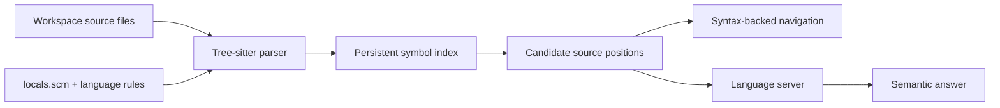

{/*
Copyright (C) 2017-2026 The Rune Authors
SPDX-License-Identifier: GPL-3.0-or-later

This program is free software: you can redistribute it and/or modify
it under the terms of the GNU General Public License as published by
the Free Software Foundation, either version 3 of the License, or (at
your option) any later version.

This program is distributed in the hope that it will be useful, but
WITHOUT ANY WARRANTY; without even the implied warranty of
MERCHANTABILITY or FITNESS FOR A PARTICULAR PURPOSE. See the GNU
General Public License for more details.

You should have received a copy of the GNU General Public License
along with this program. If not, see <https://www.gnu.org/licenses/>.
*/}

# Symbol Index

A **symbol** is a named element in source code: a function, type, method, class,
or similar declaration. A **symbol index** records selected names and source
locations ahead of time. Looking up `http.Client` in that index is much faster
than parsing and searching every file each time you need a useful source
position for it.

Rune's symbol index, implemented by `symboldb`, is a persistent, per-workspace
index built from source syntax. It lets Rune find useful starting positions for
qualified names such as `server.New`, `geometry.Shape`, or
`orders.Order.total`. Rune can then navigate directly with its syntax support or
ask a [language server](./intelligence.md) for a richer semantic answer.

The index is enabled by default. It is especially useful in large or
multi-language workspaces because it spans the whole workspace rather than one
language-server project.

## The three layers of language intelligence

The symbol index is easier to understand when separated from two neighboring
systems that are often all called “code intelligence.”

| Layer | Knows about | Best at |
| --- | --- | --- |
| **Tree-sitter syntax** | The grammatical structure of source files | Highlighting, file outlines, structural queries, and identifying definitions and references |
| **Rune's symbol index** | Qualified names and candidate locations across the workspace | Fast, persistent, cross-file lookup by name |
| **Language server (LSP)** | The language's types, builds, dependencies, and compiler semantics | Exact definitions and references, implementations, hover information, rename, completion, diagnostics, and formatting |

These layers cooperate, but none is a substitute for all the others. Consider a
request for the definition of `orders.Order.total`:

1. Tree-sitter parses workspace files and identifies declarations, references,
   imports, and other relevant syntax.
2. The symbol index records candidate locations under the qualified name
   `orders.Order.total`.
3. Rune retrieves those candidates without rescanning the workspace.
4. When an LSP server is available, Rune asks it for the exact definition at a
   candidate position. The server can account for types and project state that
   syntax alone cannot prove.



:::note[Structural queries are different]
Commands such as `searchfunc` and the agent's `list_symbols` and `query_ast`
tools run Tree-sitter queries directly. They do not search the persisted symbol
records. The symbol index and structural queries share the same syntax
foundation, but answer different questions: a structural query finds code with
a particular shape, while the index finds candidate locations for a qualified
name.
:::

## What the index powers

The index supports several paths through Rune:

- **By-name editor navigation.** The `lsp definition`, `lsp declaration`,
  `lsp type-definition`, `lsp implementation`, `lsp references`, and `lsp
  hover` commands accept a qualified name. The index finds positions from which
  Rune can make the requested language-server call.
- **Command completion.** Rune streams indexed qualified names to the command
  prompt when you enter a by-name language-intelligence command.
- **LSP fallback.** When no language server is available for a language, Rune
  can use `locals.scm` for local definitions and references, and the index for
  basic cross-file lookup and workspace symbol search.
- **Rune Agent navigation.** The agent uses the index to seed precise
  `find_definition`, `find_references`, `find_implementations`, and
  `describe_symbol` requests before asking the language server for the final
  answer.

The index is intentionally not a compiler database. It does not store inferred
types, diagnostics, complete call graphs, or every reference occurrence. Its job
is to find a small number of useful positions quickly.

## Use qualified names

An indexed name includes the package, module, type, or another containing name.
The segments are separated with dots:

| Language | Examples |
| --- | --- |
| Go | `server.New`, `server.Handler.ServeHTTP` |
| Python | `_impl.Widget`, `mypkg._impl.Widget`, `mypkg.Widget` for a re-export |
| Rust | `geometry.Shape`, `geometry.Shape.area` |
| Zig | `geometry.Shape`, `geometry.Shape.area` |

The qualifier is what makes the lookup efficient and avoids confusing unrelated
symbols that share a short name. Direct editor lookup therefore requires at
least one dot. For example:

```text
lsp definition server.New
lsp references server.Handler.ServeHTTP
lsp hover geometry.Shape
```

You do not always need the full path. Languages with nested modules may index
trailing forms as well as the complete module path. For example, a Python class
may resolve as either `mypkg._impl.Widget` or `_impl.Widget`. If more than one
location remains plausible, Rune opens a picker with path or import information
instead of choosing silently.

Cursor-based commands are unchanged. `lsp definition` with no argument asks
about the symbol under the cursor and does not require you to know its qualified
name.

## How Rune builds the index

Opening a workspace starts a background scan. Rune walks non-ignored source
files for languages that have a registered symbol-resolution specification.
Hidden directories and paths excluded by Git ignore rules are skipped. Rune
currently has specifications for Go, Python, Rust, and Zig.

Each eligible file goes through one Tree-sitter parse. Rune runs several queries
against that syntax tree as one batch:

1. The language package's `locals.scm` identifies standard syntax roles. The
   index currently uses its function and type definition captures.
2. A language-specific `symbolresolve.Spec` describes syntax that generic local
   captures cannot interpret across files: package or module qualifiers,
   imports and aliases, visibility, receiver types, methods, and re-exports.
3. Rune combines those results into qualified names and source positions.

For example, syntax can show that `Client` is a type definition, but the
language rules determine whether its indexed name is `http.Client`, whether it
is visible outside the current package, and whether `h.Client` is a reference
through an import alias. Python's rules additionally derive dotted modules from
paths and recognize package re-exports; method rules attach a receiver or class
name to the method.

### What is stored

The database has three main kinds of records:

- **Symbol records** map a qualified name to candidate file positions and mark
  each position as a reference, definition, or method definition.
- **File records** remember a file's modification time, the names it contributed,
  and its import aliases. These records let Rune replace only that file's old
  contribution after a change.
- **Name records** provide a lightweight stream of known qualified names for
  completion and workspace symbol search without loading every location.

Rune stores only the first occurrence of each occurrence kind in a file. A name
used 100 times in one file therefore contributes one reference candidate, not
100 records. That keeps common symbols compact because a later LSP references
request—not the index—is responsible for returning the complete semantic list.

The data is partitioned by workspace and persisted between Rune sessions.
Unchanged files can be recognized by their modification time and skipped on the
next scan. A schema change causes the derived data to be rebuilt.

## How Rune Agent uses the index

Rune Agent has two related tool families, and choosing the right one matters.

### Named semantic tools

The following tools first try to resolve a name through the workspace parser,
which uses the symbol index when given a qualified name:

- `find_definition`
- `find_references`
- `find_implementations`
- `describe_symbol`

The resulting positions seed LSP requests. The language server still determines
the final definition, reference set, implementation relationship, or hover
information.

Give these tools a dot-qualified name whenever possible:

```text
find_definition(symbol="server.Handler")
find_references(symbol="server.Handler.ServeHTTP")
find_implementations(symbol="storage.Store")
describe_symbol(symbol="geometry.Shape")
```

If the agent only knows a bare or partial name, it can use `search_symbols`
first:

```text
search_symbols(query="Handler")
find_definition(symbol="server.Handler")
```

`search_symbols` uses an LSP workspace-symbol request. A language server usually
answers it; when no server is available, Rune can answer from the indexed name
stream. Bare names passed directly to the semantic tools also fall back to
workspace-symbol search, but that path can be slower and ambiguous, so the
qualified two-step form is preferable.

### Structural tools

The agent's `list_symbols`, `list_file_symbols`, `query_ast`, and
`query_file_ast` tools do not look up stored symbol records. They run structural
queries through Tree-sitter. Use them when the question is about syntax or code
shape rather than the identity of one named symbol—for example, listing every
method or finding calls with two arguments.

In short:

| Question | Preferred agent tool |
| --- | --- |
| “I know the qualified name; where is it defined or used?” | `find_definition` or `find_references` |
| “I remember part of the name but not its package or file.” | `search_symbols`, then a named semantic tool |
| “Which types implement this interface?” | `find_implementations` |
| “What is this symbol's type or documentation?” | `describe_symbol` |
| “Show every function, method, or matching syntax pattern.” | `list_symbols` or `query_ast` |

This division lets the agent avoid repeatedly scanning source text and gives the
language server a relevant position from which to answer semantic questions.

## Configuration

The symbol database is enabled in Rune's default configuration:

```yaml tab
workspace:
  symboldb: true
```

```python tab
config["workspace"]["symboldb"] = True
```

There is normally no reason to disable it. If disabled, Tree-sitter highlighting
and queries still work, and active language servers still provide semantic
features. However, by-name resolution may need to scan the workspace on demand,
and syntax-backed workspace symbol search is unavailable. Workspace settings are
read when the workspace is created, so restart Rune after changing this option.

## Limits and trade-offs

Keep these boundaries in mind when interpreting results:

- **The index is syntax-derived.** It recognizes patterns described by the
  grammar and Rune's language rules; it does not type-check the program.
- **Only registered languages are indexed.** A Tree-sitter grammar is enough
  for syntax highlighting and structural queries, but cross-file symbol indexing
  additionally needs a core `symbolresolve.Spec`.
- **It covers workspace files.** Dependencies or standard-library sources
  outside the workspace are normally the language server's responsibility.
- **It reads saved files.** Unsaved edits are not persisted in the index.
- **It is selective.** Cross-file definitions focus on functions, types,
  methods, and supported re-exports. Variables and constants are not generally
  indexed as definitions.
- **Visibility is language-specific and sometimes approximate.** For example,
  Go filters definitions by exported-name rules, while languages whose syntax
  captures do not expose visibility may admit more candidates.
- **It stores candidates, not a complete reference graph.** Repeated uses in one
  file are collapsed, and dynamic or ambiguous constructs may remain unresolved.
- **Git-ignored paths and hidden directories are skipped.** This keeps dependency
  caches and generated output out of the initial workspace scan, but also means
  symbols in those paths are absent.

When syntax cannot establish a relationship safely, Rune prefers no result over
an incorrect jump. Use LSP-backed navigation when compiler-accurate behavior is
important.

## Troubleshooting a missing symbol

If a qualified lookup does not find a workspace symbol:

1. **Save the defining file.** The persistent index does not observe unsaved
   buffer edits.
2. **Use a qualified name.** Direct editor lookup needs a dotted package,
   module, or type prefix.
3. **Check indexing progress.** A new workspace may still show the **Indexing
   workspace symbols** notification.
4. **Check the path.** Git-ignored files and hidden directories are not part of
   the scan.
5. **Check the language tier.** The language needs symbol-index support, not
   only a grammar package.
6. **Separate discovery from semantics.** If Rune finds the candidate but hover,
   implementations, or exact references fail, troubleshoot the language server
   using the [Code Intelligence](./intelligence.md) guide.

## Adding index support to a language

Language-package authors need both syntax assets and Rune-core language rules.
At a high level:

1. Package the native Tree-sitter grammar and a `locals.scm` with definitions,
   references, and scopes.
2. Add a `symbolresolve.Spec` that describes package or module names, imports,
   aliases, methods, visibility, nested modules, and re-exports as appropriate.
3. Register the specification for the language's filename extensions.
4. Add multi-file fixtures and symbol-resolution tests using the real grammar,
   packaged queries, and resolver specification.

The language extension subprocess does not populate this database. Rune core
loads the syntax assets and owns indexing. See [Teach the indexer how names
cross files](../develop/languages.md#6-teach-the-indexer-how-names-cross-files)
and [Test the integration as a whole](../develop/languages.md#9-test-the-integration-as-a-whole)
for the implementation checklist.

For source-level details, start with the
[`symboldb`](https://github.com/unstablebuild/rune/tree/main/internal/ide/syntax/symboldb)
package, the
[`symbolresolve`](https://github.com/unstablebuild/rune/tree/main/internal/ide/idelsp/symbolresolve)
language specifications, Rune's
[`syntax fallback`](https://github.com/unstablebuild/rune/blob/main/internal/ide/idelsp/fallback.go),
and the agent's
[`LSP`](https://github.com/unstablebuild/rune/blob/main/cmd/rune-agent/agent/agentools/lsp.go)
and
[`syntax`](https://github.com/unstablebuild/rune/blob/main/cmd/rune-agent/agent/agentools/syntax.go)
tools.
